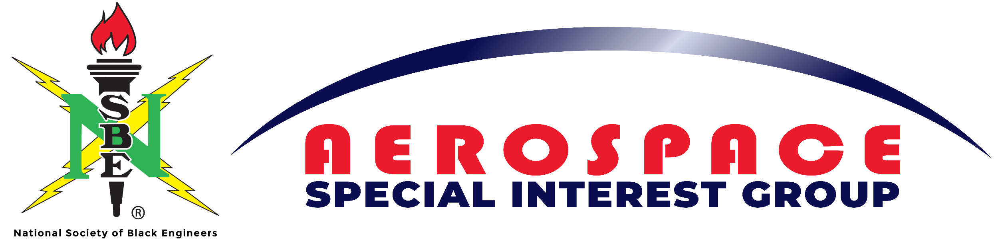
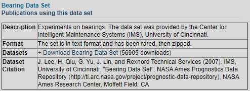

# Research_Internship

# Table of contents
1. [Introduction](#introduction)

<!--
see how to make table of contents in markdown: https://stackoverflow.com/questions/11948245/markdown-to-create-pages-and-table-of-contents

2. [Some paragraph](#paragraph1)
    1. [Sub paragraph](#subparagraph1)
3. [Another paragraph](#paragraph2)
-->
## This is the introduction 
This project was created as a requirement of to the fulfilment of the NSBE Aerospace SIG Research intern position for the 2020-2021 fiscal year. The project chosen was a predictive maintenance problem on data for a Rexnort ZA-2115 bearing generated by the center of Intelligent Maintenance Systems (IMS) at the University of Cincinnati.
Dataset was obtained from NASA progrostic data repository.

Link:
[NASA - Prognostic Center of Excellence](https://ti.arc.nasa.gov/tech/dash/groups/pcoe/prognostic-data-repository/#bearing)

<!--
## Some paragraph 
The first paragraph text

### Sub paragraph 
This is a sub paragraph, formatted in heading 3 style

## Another paragraph 
The second paragraph text

-->